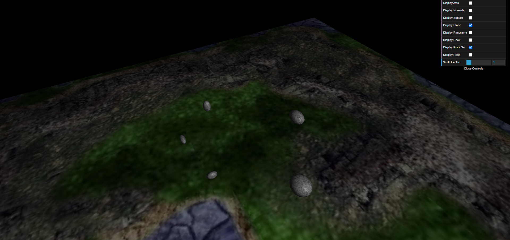
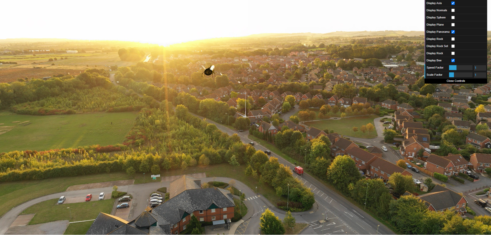

# CG 2023/2024 Projeto

## Grupo T4G7

- Diogo Sarmento up202108890@up.pt
- Rodrigo Póvoa up202108890@up.pt

## Projeto Final

### Descrição do Projeto e objetivos

#### Descrição

Pretende-se com este projeto a criação de uma cena que combine a aprendizagem efetuada nas aulas anteriores e que explore algumas novas técnicas de Computação Gráfica. Deve usar como base o código que é fornecido no Moodle, que corresponde a uma cena com um plano de 400x400 unidades. Terá posteriormente de adicionar vários novos objetos.

A cena, no final do projeto, deve ser genericamente constituída (pelo menos) por:

- Uma representação do céu com nuvens em movimento (ou movimento em parábola da abelha)
- Um terreno plano, coberto com relva, contendo um jardim com flores
- Uma abelha, animada e controlável pelo utilizador
- Um monte de pedras/penedos, no topo do qual se encontra uma colmeia.

Os pontos seguintes descrevem as principais características dos diferentes elementos pretendidos. É dada alguma liberdade quanto à composição dos mesmos na cena, para que cada grupo possa usar de criatividade e originalidade na obtenção da sua própria cena.

#### Objetivos

- Aplicar os conhecimentos e técnicas adquiridas até à data
- Utilizar elementos de interação com a cena, através do teclado e de elementos da interface gráfica
- Utilizar Shaders na modelação/visualização de objetos
- Utilizar animação de componentes

### Tópicos

#### Tópico 1: Sky-Sphere

##### Criação de uma esfera

Para a criação de uma esfera, foi utilizado o seguinte ficheiro ``MySphere.js``, que contém 
os vértices, indícies, normais e texturas necessárias para a criação de uma esfera. No ficheiro ``MyScene.js`` foi aplicada a textura.

##### Adição de Panoramas 

Para a criação de um panorama, foi utilizado os seguintes ficheiros ``MySphere.js`` e ``MyPanorama.js``. O ficheiro ``MyPanorama.js`` utiliza o Sphere, mas inverte-o e aumenta o seu tamanho para ser visto de dentro. Alterou-se também o fov, sendo este só aplicado quando o panorama está ativo.

#### Tópico 2: Flores

Para a modulação da flor utilizamos os ficheiros MyFlower.js, MyPetal.js, MyReceptacle.js, MyStem.
No MyFlower juntamos todos os componentes, no Mypetal criamos a petala a partir de dois triangulos, no MyReceptacle criamos uma esfera e no MyStem criamos o caule que dependendo do tamanho pode ter folhas

Relativamente a parametrização da flor aceitamos argumentos como as coordenadas do pe da flor, o tamanho do caule, o raio do caule, o tamanho do receptaculo o tamanho do raio exterior isto é o tamanho das petalas - tamanho do receptáculo, número de petalas, a cor das petalas, do caule, das folhas e do receptáculo

No MyFlower parâmetros como o tamanho da folha, o tamanho de cada segmento do caule, curvatura do caule, diferente rotação das pétalas , a rotação da folha relativa ao eixo do caule, depois na criação do MyGarden.js introduzimos cores aleatórias e tamanhos aleatórios nos parâmetros de cada flor.

#### Tópico 3: Pedras e Penedos

Para a criação da rocha, foram utilizados os seguintes ficheiros ``MyRock.js``, ``MyRockSet.js`` e ``MyRockPyramid``.

Enquanto estavamos a desenvolver a rocha, reparamos na importância de o offset do primeiro ser exatemente igual ao último, senão existia a possibilidade de haver um buraco visível. As rochas tem scalings aleatórios em 3 eixos, juntamente com uma inclinação aleatória, para que não sejam todas iguais.

Para o RockSet, foi utilizado um array de rochas, que são desenhadas em posições aleatórias. O número de rochas é definido pelo utilizador, sendo o default 10.

Para a RockPyramid, foi utilizado um array de rochas, que são desenhadas em vários níveis, colados uns aos outros. O número de níveis da pirâmide é definido pelo utilizador, sendo o default 5 níveis.

#### Tópico 4: Abelha

Foi desenvolvida uma abelha com uma AI simples.

##### Modelação da Abelha

Para modelar a abelha foram utilizados as seguintes componentes:

- 1x Head (Sphere)
- 2x Eyes (Sphere)
- 1x Torax (Sphere)
- 1x Abdomen (Sphere)
- 2x Antennas (Cylinder & Sphere)
- 4x Legs (2x Cylinder & Sphere)
- 1x Sting (Cone)
- 2x Mandibles (Cone)
- 2x Pairs of Wings (Eliptic Circle)

##### Animação da Abelha

Para a animação da abelha, podemos separar em 2 partes:

- A oscilação da abelha, definida através de uma função seno nos eixos YY.

- A oscilação das asas, definida através de uma função seno nos eixos ZZ, rodando no ponto de contacto com o corpo, evitando assim que a asas "cortem" a abelha.	

##### Controlo da Abelha

Para controlar a abelha, foram utilizadas as seguintes teclas:

- W: Move para a frente, Acelerando a velocidade
- S: Move para trás, Desacelerando a velocidade
- A: Roda para a esquerda
- D: Roda para a direita
- R: Reseta a posição da abelha (posição, velocidade e aceleração)
- F: Desce a abelha, constantemente. Para parar de descer pressionar novamente o F.
- P: Sobe a abelha, constantemente. Para parar de subir pressionar novamente o P.
- O: Ativa/Desativa a AI da abelha. Isto é, a abelha começa a voar sozinha em direção ao pólen mais próximo, se existir. Quando chega a um pólen, ela para, sendo necessário ativar a AI para ir em direção à colmeia

Adicionalmente, o user pode controlar a velocidade e o scaling da abelha, como desejar, através de um slider.
Também foi adicionada uma vista da abelha, que pode ser ativada através da checkbox ``Use Bee View``.

#### Tópico 5: Pólen e Colmeia

Para estas 2 partes, foram feitos os seguintes:

- Para o pólen, foram utilizados 2 spheres, às quais foram aplicadas uma textura de pólen, que depois foi alterada através do shader para ter a cor laranja desejada. O pólen vai ter uma inclinação aleatória.

- Para a colmeia, foi utilizada conjuntos de cubos para simular uma colmeia moderna. A colmeia tem um formato de caixa, com suportes e uma tampa levantada. No seu interior é constituído por frames e handles, onde contém o mel.

- A abelha quando entra em contacto com um pólen, mexe as "patas", de forma a simular o transporte do pólen para a colmeia. Após chegar à colmeia, a abelha para e a colmeia é preenchida com o pólen.

#### Tópico 6: Shaders e animação

##### Modelação da relva
Criamos a relva a partir de triângulos em que cada segmento unitário composto por dois triângulos e com um triângulo no topo
Para a animação, atualizamos o ângulo da curvatura que resulta neste resultado.

##### Ondulação da relva

#### Tópico 7: Desenvolvimentos adicionais 

Para o desenvolvimento adicional, decidimos implementar um movimento parabólico da abelha, que foi implementado na AI da Abelha. 

