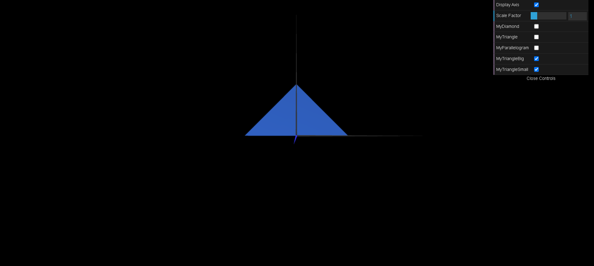

# CG 2023/2024

## Group T04G07

## TP 1 Notes

- No exercício 1, observamos algumas dificuldade em tentar dar display ao Triângulo e ao Paralelogramo, mas eventualmente as nossas dúvidas foram esclarecidas. Para tornar o paralelogramo vísivel em 2 lados, adicionamos os mesmos indices que tínhamos, mas na sua forma inversa

```javascript
//Counter-clockwise reference of vertices
        this.indices = [
            0, 1, 2,
            2, 3, 0,
            2, 1, 0,
            0, 3, 2
        ];
```
- No exercício 2, na qual era pedido criar um triângulo grande e pequeno, bastou criar 2 ficheiros diferentes, correspondente a cada um e com a sua checkbox respetiva.


