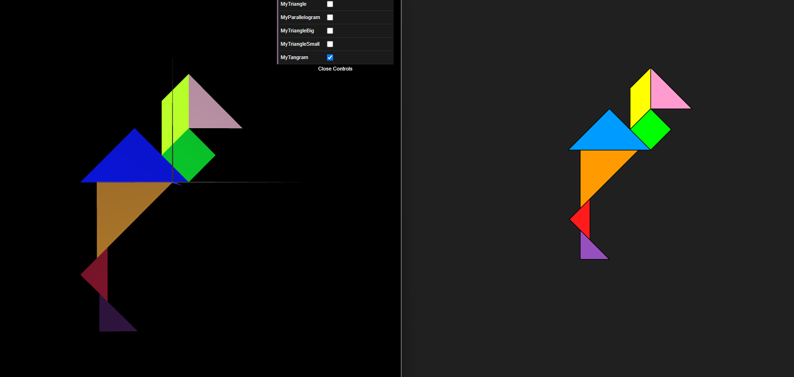
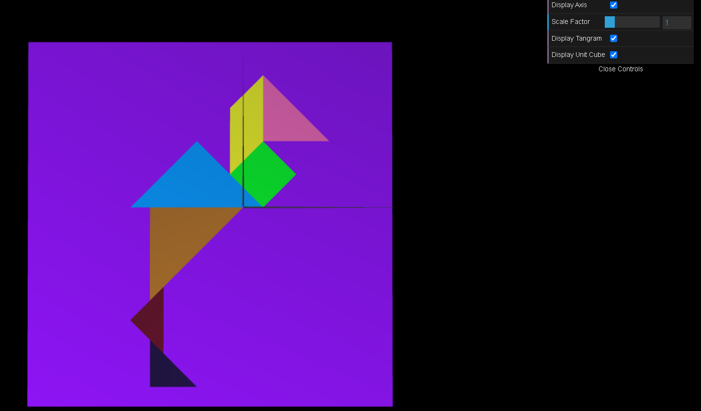
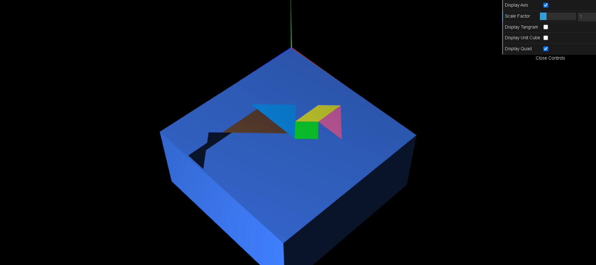

## tp 2-1: 
   - Based on the figures developed in the last class and through successive transformations, we replicate this figure.
    
## tp 2-2:
- In addition to what we did in exercise 2-1, we added a cube centered in the reference frame for exercise 2-2. Check out the image below:

## tp 2-3:
