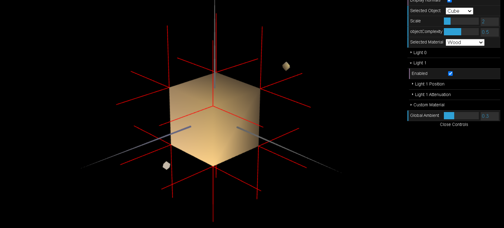
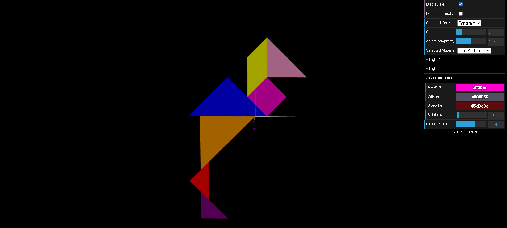
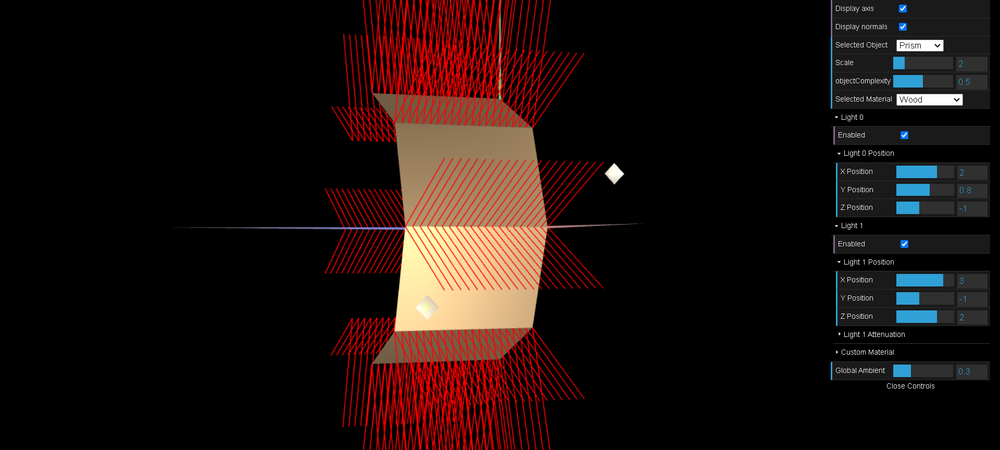
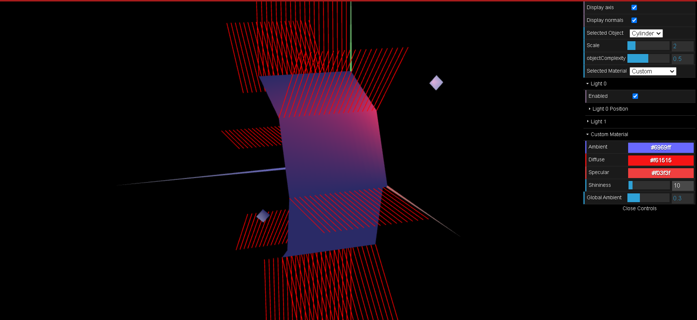

# CG 2023/2024

## Group T04G07

## TP 3 Notes

- No exercício 1, tivemos de declarar as normais para os objetos criados nas aulas passadas, com especial atenção ao cubo, dado que sem as normais, não seria possível fazer experiências com a luz. Para tal, foi necessário criar uma nova var `this.normals`.

De seguida criamos, um material com textura respetiva a cada peça do nosso tangram.

- No exercício 2, foi-nos pedido para criar um prisma na qual os seus vertices, normais e indices fossem criadas com um algoritmo nosso, o que na nossa opinião, foi a parte mais desafiante do trabalho desta semana.

- No exercício 3, foi-nos pedido para criar um outro prisma, na qual o método de iluminação a ser utilizado seria o de Gouraud. Foi possível observar a diferença entre o método de iluminação anterior e Gouraud.

